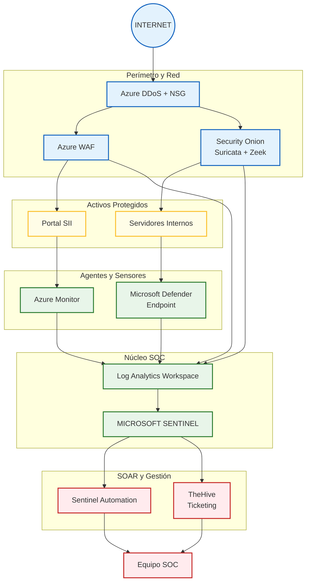

# Arquitectura-SOC-SII

```mermaid
graph TD
    %% Nodos Principales
    Internet((INTERNET))
    
    subgraph Perimetro [Perímetro y Red]
        DDoS[Azure DDoS + NSG]
        WAF[Azure WAF]
        IDS[Security Onion<br/>Suricata + Zeek]
    end
    
    subgraph Activos [Activos Protegidos]
        Portal[Portal SII]
        Servers[Servidores Internos]
    end
    
    subgraph Sensores [Agentes y Sensores]
        Monitor[Azure Monitor]
        EDR[Microsoft Defender<br/>Endpoint]
    end

    subgraph Core [Núcleo SOC]
        Logs[Log Analytics Workspace]
        SIEM[MICROSOFT SENTINEL]
    end

    subgraph Respuesta [SOAR y Gestión]
        Auto[Sentinel Automation]
        Hive[TheHive<br/>Ticketing]
    end

    Team[Equipo SOC]

    %% Relaciones
    Internet --> DDoS
    DDoS --> WAF
    DDoS --> IDS
    
    WAF --> Portal
    IDS --> Servers
    
    Portal --> Monitor
    Servers --> EDR
    
    Monitor --> Logs
    EDR --> Logs
    IDS --> Logs
    WAF --> Logs
    
    Logs --> SIEM
    SIEM --> Auto
    SIEM --> Hive
    
    Auto --> Team
    Hive --> Team
    
    %% Estilos
    classDef blue fill:#e3f2fd,stroke:#1565c0,stroke-width:2px;
    classDef yellow fill:#fffde7,stroke:#fbc02d,stroke-width:2px;
    classDef green fill:#e8f5e9,stroke:#2e7d32,stroke-width:2px;
    classDef red fill:#ffebee,stroke:#c62828,stroke-width:2px;
    
    class Internet,DDoS,WAF,IDS blue
    class Portal,Servers yellow
    class Monitor,EDR,Logs,SIEM green
    class Auto,Hive,Team red
```
