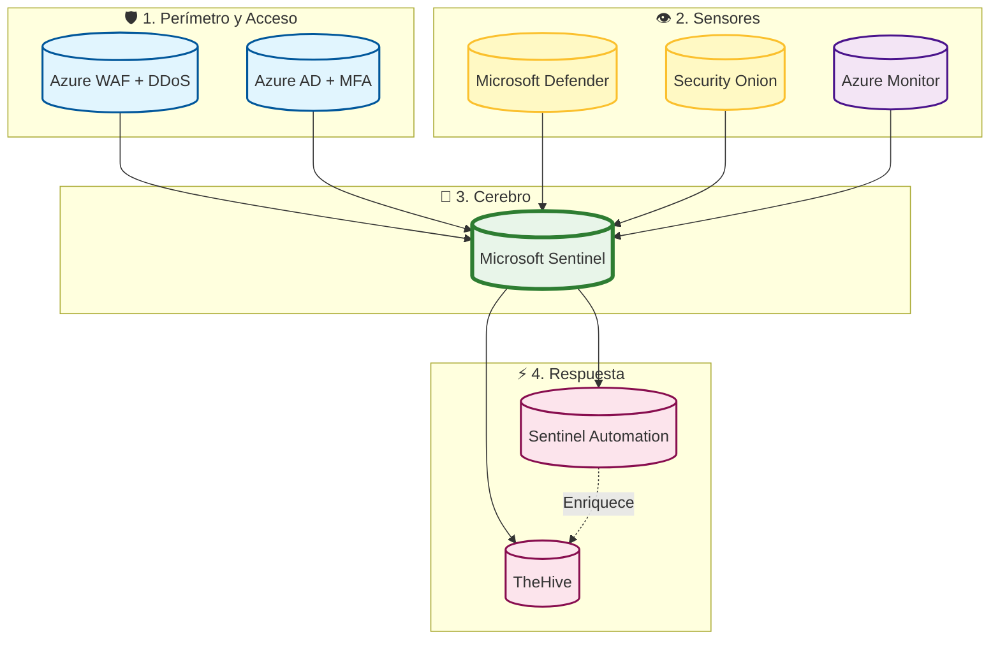

# Arquitectura-SOC-SII

```mermaid
graph TD
    %% Estilos
    classDef protect fill:#e1f5fe,stroke:#01579b,stroke-width:2px;
    classDef detect fill:#fff9c4,stroke:#fbc02d,stroke-width:2px;
    classDef siem fill:#e8f5e9,stroke:#2e7d32,stroke-width:4px;
    classDef soar fill:#fce4ec,stroke:#880e4f,stroke-width:2px;
    classDef monitor fill:#f3e5f5,stroke:#4a148c,stroke-width:2px;

    subgraph Perimetro ["🛡️ 1. Perímetro y Acceso"]
        WAF[("Azure WAF + DDoS")]:::protect
        AAD[("Azure AD + MFA")]:::protect
    end

    subgraph Deteccion ["👁️ 2. Sensores"]
        EDR[("Microsoft Defender")]:::detect
        NDR[("Security Onion")]:::detect
        MON[("Azure Monitor")]:::monitor
    end

    subgraph SIEM ["🧠 3. Cerebro"]
        Sentinel[("Microsoft Sentinel")]:::siem
    end

    subgraph SOAR ["⚡ 4. Respuesta"]
        Auto[("Sentinel Automation")]:::soar
        Hive[("TheHive")]:::soar
    end

    %% Conexiones
    WAF & AAD --> Sentinel
    EDR & NDR & MON --> Sentinel
    Sentinel --> Auto
    Sentinel --> Hive
    Auto -.->|Enriquece| Hive
```
